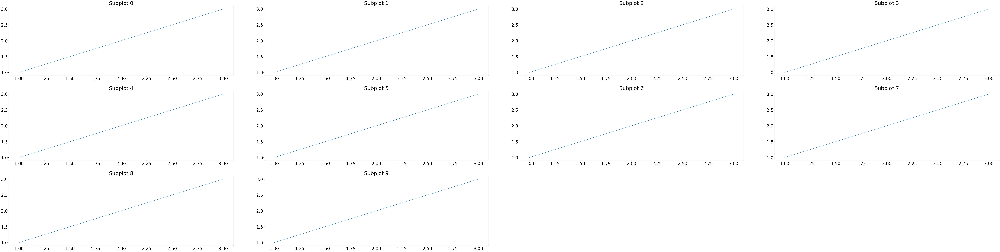

# Matplotlib AutoLayout
Matplotlib AutoLayout enables developers to easily create complex multiplots and multi-axes layouts without worrying about the exact positioning of the plots. The library automatically calculates the positions of the plots and axes based on the number of rows and columns specified by the user.

## Usage
1. Install the package
`pip install matplotlib-autolayout`
2. Import the packages needed
```python
# matplotlib-autolayout
from matplotlib_autolayout.autolayout import autolayout
# matplotlib
import matplotlib.pyplot as plt
```
3. Create a matplotlib figure and add subplots
```python
fig = plt.figure(figsize=(10, 5))
# font size
plt.rcParams.update({'font.size': 30})
# add 10 subplots
for i in range(10):
    fig.add_subplot(title=f"Subplot {str(i)}").plot([1, 2, 3], [1, 2, 3])
```
4. Define a configuration
```python
configuration = {
    'direction': 'column',
    'margin': 0.3,
    'count': 4
}
```
5. Feed into autolayout and show the plot
```python
autolayout(fig, configuration=configuration)
fig.show()
```
6. Multiplot produced

